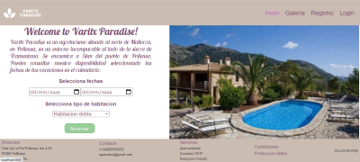

# PROYECTO AGROTURISMO CREADO CON REACT :four_leaf_clover:

API REST creada en frontend como website de agroturismo "Varitx Paradise", destinada a hacer reservas para pasar vacaciones en una finca de agroturismo situada en el norte de Mallorca. 

## DESCRIPCIÓN :open_book:

El proyecto consta de una página *HOME* con un menú de navegación desde el que un *usuario* puede registrarse, hacer login o acceder a una galería de imágenes.

En el cuerpo de la página, puede acceder a un calendario desde el cual elegir una fecha de entrada y otra de salida, tipo de habitación a través de un menú desplegable y hacer una reserva.

Una vez hecho el login, puede acceder a sus reservas.

## TECNOLOGÍAS :gear:

:large_blue_circle: REACT, REACT-ROUTER-DOM.

:large_blue_circle: GIT.

:large_blue_circle: GIT FLOW.

:large_blue_circle: SASS.

:large_blue_circle: ANT DESIGN.

:large_blue_circle: BOOTSTRAP.

## VISTAS DE USUARIO :bust_in_silhouette:

:radio_button: HOME.

:radio_button: REGISTRO.

:radio_button: LOGIN.

:radio_button: GALERIA.

:radio_button: PROFILE.

:radio_button: RESERVAS.

